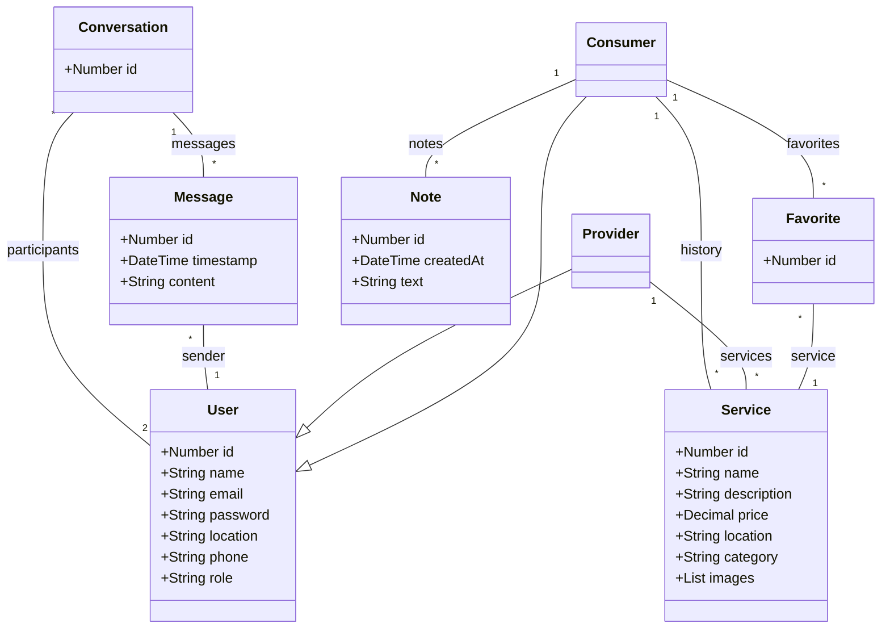

**Projeto: Catálogo Comunitário de Serviços Locais**

**1. Visão Geral**
O Catálogo Comunitário de Serviços Locais é uma aplicação Full‑Stack voltada a conectar prestadores de serviços (autônomos, pequenas empresas) a consumidores em uma determinada região. O objetivo é facilitar a divulgação de serviços e a busca por profissionais locais, promovendo o desenvolvimento comunitário e o fomento da economia de bairro.

**2. Objetivos**

* Dar visibilidade online a prestadores de serviços que ainda não possuem presença digital.
* Oferecer aos consumidores um meio prático de encontrar e contratar serviços próximos.
* Criar uma plataforma intuitiva, responsiva e escalável.

**3. Usuários e Perfis**

* **Prestador**: realiza cadastro, gerencia seus serviços e atende consumidores via chat.
* **Consumidor**: busca e contrata serviços, gerencia favoritos, histórico e notas pessoais.

**4. Requisitos Funcionais**

1. **Autenticação e Autorização**

   * Cadastro de usuário com papel (consumidor ou prestador), nome completo, e‑mail, senha (com confirmação), telefone e localização.
   * Login com e‑mail e senha, com autenticação JWT.
   * Recuperação de senha via e‑mail.

2. **Dashboard**

   * Acesso via sidebar com rotas: Dashboard, Procurar Serviços, Favoritos, Chats e (para prestadores) Meus Serviços.

3. **Dashboard do Consumidor**

   * Visualização do histórico de serviços utilizados: cards com nome do serviço, provedor, descrição, data e localização.
   * Lista de serviços favoritos.
   * Seção de notas pessoais, com data e conteúdo, além de botão para adicionar novas notas.

4. **Busca de Serviços**

   * Página com barra de pesquisa, filtros por categoria e faixa de preço.
   * Exibição de serviços em cards (imagem, nome, provedor, localização, categoria), com botões "Favoritar" e "Contratar".

5. **Favoritos**

   * Página com os serviços favoritos do usuário.
   * Mesmos filtros e estrutura da busca de serviços.

6. **Chats**

   * Lista de conversas com nome do contato, última mensagem e horário.
   * Ao clicar, o usuário acessa o histórico de mensagens e pode enviar novas.

7. **Meus Serviços (para Prestadores)**

   * Tela de gerenciamento de serviços: listar, editar ou remover.
   * Formulário para criar novo serviço com os seguintes campos: nome, descrição, preço, localização (opcional), categoria, imagens (opcionais).

8. **Serviços**

   * Cada serviço possui: nome, descrição, preço, localização (opcional), categoria, imagens (até 5).

**5. Arquitetura e Tecnologias Sugeridas**

* **Front‑end**: Next.js.
* **Back‑end**: NestJS.
* **Banco de Dados**: PostgreSQL.
* **Autenticação**: JWT.
* **Chat**: Socket.io (ou alternativa).
* **Deploy**: Vercel (Front) + Railway (Back).

**6. Diagrama de Classes (UML)**

**7. API RESTful (rotas principais)**

| Método | Rota                      | Descrição                     |
| ------ | ------------------------- | ----------------------------- |
| POST   | /api/auth/register        | Cadastro de usuário           |
| POST   | /api/auth/login           | Login                         |
| GET    | /api/users/me             | Obter dados do usuário logado |
| PUT    | /api/users/me             | Atualizar perfil              |
| POST   | /api/services             | Criar serviço                 |
| GET    | /api/services             | Listar serviços (com filtros) |
| GET    | /api/services/\:id        | Detalhar um serviço           |
| PUT    | /api/services/\:id        | Atualizar serviço             |
| DELETE | /api/services/\:id        | Deletar serviço               |
| POST   | /api/services/\:id/images | Upload de imagens             |

---

Este documento serve como guia principal para a implementação do MVP e a evolução futura do Catálogo Comunitário de Serviços Locais.
